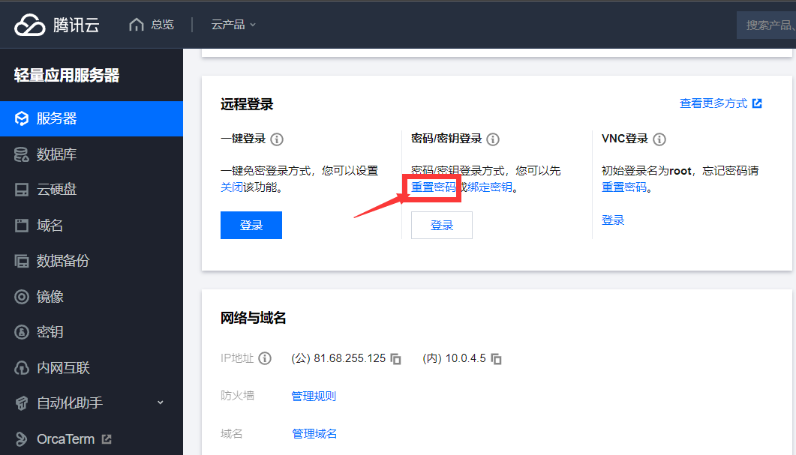
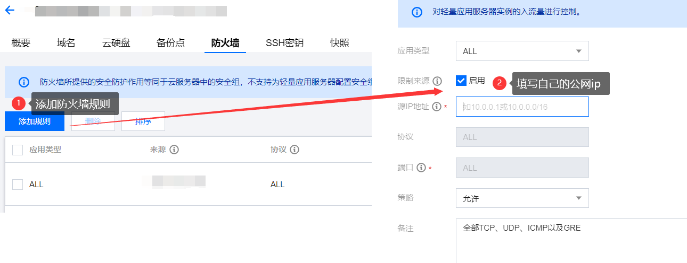
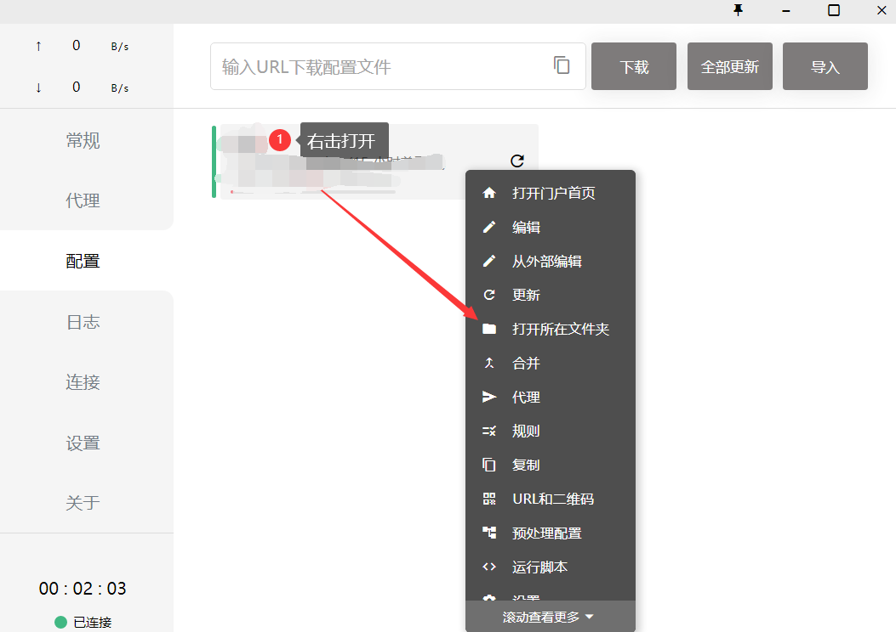
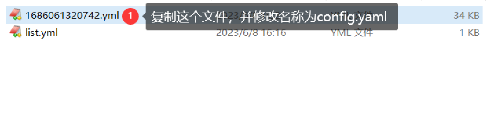
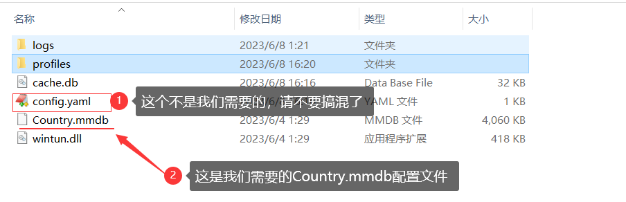

# 搭建ChatGPT微信聊天机器人

​		首先，感谢GitHub上的开源大佬！其项目地址：<a href="https://github.com/zhayujie/chatgpt-on-wechat">https://github.com/zhayujie/chatgpt-on-wechat</a>，对于他的项目地址我修改了少许部分，以实现在国内服务器上部署（当然这里需要**魔法**，找不到魔法的同学可以评论区留言）。这里是我的项目地址：<a href="https://github.com/Peteroyu/chatgpt-on-wechat">https://github.com/Peteroyu/chatgpt-on-wechat</a>。

#### 1、准备服务器

##### 1.1 服务器密码及安全组规则修改

​		这里我是用的是腾讯云国内服务器，有条件的同学可以直接选择国外的云服务器，服务器器配置不需要太高，1核1g都可以。服务器购买之后，系统选择`Centos7.6`，随后进入https://console.cloud.tencent.com/lighthouse/，按下图位置==重置服务器密码==：



​		随后添加服务器防火墙规则，方便后面通过Xshell工具调试，其添加过程如下图：



##### 1.2 root用户登录及密码登录限制

​		系统默认root用户不可通过ssh登录，而且默认不支持密码验证。所以我们需要开启这两个选项：在`/etc/ssh/sshd_config`配置文件中`PermitRootLogin`是一项关于`SSH`服务的配置选项，它允许或禁止root用户通过SSH登录到服务器；而`passwordauthentication`指定是否要使用基于密码的认证：

> `ps`：具体的`vim`操作和`xshell`连接服务器比较简单，请自行查找。

```bash
#修改sshd_config配置文件
vim /etc/ssh/sshd_config

#开启允许root用户ssh登录
PermitRootLogin yes
#允许通过密码登录
PasswordAuthentication yes

#限制人员地址登录，最后一行加入(这个配置可以不用加入配置)
AllowUsers Peter@192.168.0.222 root@192.168.1.135 //多个用户名@IP之间使用空格分隔

#配置修改完成后，重启ssh服务
service sshd restart
```

#### 2、开始安装

##### 1.1 安装Python

###### 1.1.1 Python依赖安装

​		因为系统的很多软件版本可能过低，所以需要首先更新系统的软件，该过程可能会耗时1-2分钟，请耐心等待；随后安装Python的依赖包：

```bash
#更新系统软件库
yum -y update
#安装python依赖
yum -y install zlib-devel bzip2-devel openssl-devel ncurses-devel sqlite-devel readline-devel tk-devel gcc make
	
#添加epel扩展源
yum -y install epel-release libffi-devel

#这里顺便先把git也下载安装
yum install -y git
```

###### 1.1.2 Python安装包下载

​		依赖安装完成后，准备开始安装`python`。该项目推荐使用`Python3.8`版本，首相先在`Centos`中准备文件夹，通过`mkdir `在`/opt`中创建文件夹来保存项目源码和`Python`安装包：

```bash
#按一下指令依次执行
cd /opt #进入opt目录
mkdir software package #创建两个文件夹，software用于安装程序目录，package用于安装包目录

#进入package目录 下载python源码
cd /opt/package
#这里通过淘宝商家镜像资源下载（源地址下载速度较慢）
wget http://npm.taobao.org/mirrors/python/3.8.2/Python-3.8.2.tar.xz

#解压安装到software文件夹中
xz -d Python-3.8.2.tar.xz
tar -xvf Python-3.8.2.tar -C /opt/software

#进入python安装包文件夹，执行编译安装，这里耗时比较长
cd /opt/software/Python-3.8.2/
./configure prefix=/usr/local/python3
make && make install
```

###### 1.1.3 Python软连接修改

​		由于Centos系统默认安装了`python2`，其`python`软连接默认指向`python2`所以这里需要需改一下默认配置：

```bash
#进入/etc/bin，并连续执行以下代码
cd /usr/bin/

#将原来的链接备份
mv /usr/bin/python /usr/bin/python.bak

#添加python3的软链接
ln -s /usr/local/python3/bin/python3.8 /usr/bin/python

#测试是否安装成功了，若显示版本号为3.8，则配置修改完成
python -V
```

> `ps`：这里需要注意的是，修改python的软连接后，会导致部分基于python设计的指令变得不可用，我们只需要修改其指令文件的头部配置即可，如下操作修改`yum`：

```bash
vi /usr/bin/yum:
#如下将原文件中的python修改为python2
#!/usr/bin/python ---> #!/usr/bin/python2

#这里同上
vi /usr/libexec/urlgrabber-ext-down
#! /usr/bin/python ---> #! /usr/bin/python2
```

###### 1.1.4 pip软链接修改

​		后面的项目依赖安装需要通过python3.8.2的pip3来安装，而系统默认pip为python2版本的，所以这里也需要对其软连接进行修改：

```bash
# 进入usr/bin目录
cd /usr/bin
 
# 重新设置pip文件
ln -s /usr/local/python3/bin/pip3 /usr/bin/pip

pip --version
#这里检查版本，会得到下面的信息，可以看到这里是基于3.8，故配置完成
#pip 19.2.3 from /usr/local/python3/lib/python3.8/site-packages/pip (python 3.8)

#完成pip的更新，之后可以看到pip更新至pip-23.1.2版本
pip install --upgrade pip
```


##### 1.2 项目源码下载及其依赖下载

###### 1.2.1 项目源码下载并安装

​		通过git克隆项目源码，可能出现下载超时等下载问题，这时可通过github镜像网站下载源码，请自行查找：

```bash
cd /opt/software

#这里使用git将项目克隆下来
git clone https://github.com/Peteroyu/chatgpt-on-wechat.git
```

​		源码下载完成，开始源码中作者已经准备`requirements.txt`文件中的依赖包安装。但是这里需要提前解决一个问题：`openai`依赖于`urllib3`，但由于`Centos7.6`安装的`open SSL`低于`2.0`，而`urllib3`的`2.0`以上版本是基于`open SSL 2.0`以上版本的，所以为了方便这里需要对`urllib3`进行降级安装，之后开始项目依赖安装：

```bash
#urllib3降级安装
pip uninstall urllib3
pip install 'urllib3<2.0'

#项目依赖安装
pip install -r requirements.txt
```

###### 1.2.2 配置文件修改

​		到这里，所有的安装已经全部完成，这里开始配置文件的修改，完成配置代理地址、API_KEY等配置：

```bash
cd /opt/software/chatgpt-on-wechat
#修改配置文件名
mv config-template.json config.json

#开始修改配置
vim config.json
```

​		这里我对原作者的进行格式修改，并添加了代理地址配置，其他变化不大。这里最重要的就是完成配置代理配置和API配置：

> `ps`：需要openai的注册方式请评论区留言，这里不太方便讲述，api的获取地址为：https://platform.openai.com/account/api-keys

```bash
{
  "open_ai_api_key": "YOUR API KEY 这里覆盖填写你的OpenAI的api——key",
  "model": "gpt-3.5-turbo",
  "proxy": "http://127.0.0.1:7890",#这里填写你的代理地址，也就是魔法
  "single_chat_prefix": [ "GPT-3", "@GPT-3" ],#这里是你一对一对话唤醒AI对话的前缀
  "single_chat_reply_prefix": "[GPT-3] ",#这里回复前缀
  "group_chat_prefix": [ "GPT","gpt","GPT-3","@GPT-3" ],#这里是你群对话中唤醒AI对话的前缀
  "group_name_white_list": [ "ALL_GROUP" ],#所能使用的群名，建议不修改这里
  "group_chat_in_one_session": [ "ALL_GROUP" ],#建议不修改
  "image_create_prefix": [ "画" ],#触发画图功能对话前缀：比如：@GPT-3 画一只小猫
  "speech_recognition": true,
  "group_speech_recognition": false,
  "voice_reply_voice": false,
  "conversation_max_tokens": 1000,
  "expires_in_seconds": 3600,
  "character_desc":"你是chatGPT, 一个由OpenAI训练的大型语言模型, 你旨在回答并解决人们的任何问题，并且可以使用多种语言与人交流。",
  "subscribe_msg": "感谢您的关注！"
}
```

​		原始代码中限定图片分辨率为`256x256`，如果你克隆的是我的项目代码，则已经修改为`1024x1024`，否则你需要修改一个简单配置：

```bash
cd /opt/software/chatgpt-on-wechat/bot/openai/ #进入该目录
#编辑open_ai_image.py文件
vim open_ai_image.py #修改代码中256x256为1024x1024
```

###### 1.2.3 魔法安装

​		我是用的是`clash`，服务端安装比较方便。首先下载：

```bash
cd /opt/package/
wget https://github.com/Dreamacro/clash/releases/download/v1.16.0/clash-linux-amd64-v1.16.0.gz
# 这里下载不下来的同学，也可以通过本地下载，然后通过xftp上传到服务器

#解包
gunzip clash-linux-amd64-v1.16.0.gz 
#修改文件名
mv clash-linux-amd64-v1.16.0 clash
#添加执行权限
chmod +x clash 

#这里需要先执行一次，然他在~/.config文件中创建文件夹和一些文件
./clash
cd ~/.config/clash/
```

​		到了这里之后，需要将自己电脑中安装的clash配置文件`config.yaml`和`Country.mmdb`，拷贝到服务器`~/.config/clash/`文件夹中，配置文件位置查找方式如下：

- `config.yaml`配置文件：





- `Country.mmdb`配置文件：这里需要相对上一个文件夹后退一个文件夹，就可以发现该配置文件



​		将上面两个文件拷贝至服务器`~/.config/clash/`中，之后开始直接执行`clash`脚本就可以了：

```bash
cd /opt/package/

#通过后台运行
nohup ./clash >/dev/null 2>&1 &
```

#### 3、运行

​		到了这里，这里所有已经配置完成。通过以下代码执行运行，运行后可以在控制台看到微信的二维码登录，这里==建议使用微信小号登录==：（若控制台未显示，则可以查看nohup.out日志文件）

```bash
cd /opt/software/chatgpt-on-wechat
nohup python app.py & tail -f nohup.out          # 在后台运行程序并通过日志输出二维码

#若启动失败，可以通过ps和kill指令杀掉后台（具体实现请百度）
```

> `ps`：登陆后，手机端的微信号也需要保持登录，否则服务端会掉线，需要再次执行`nohup python app.py & tail -f nohup.out`进行服务启动。